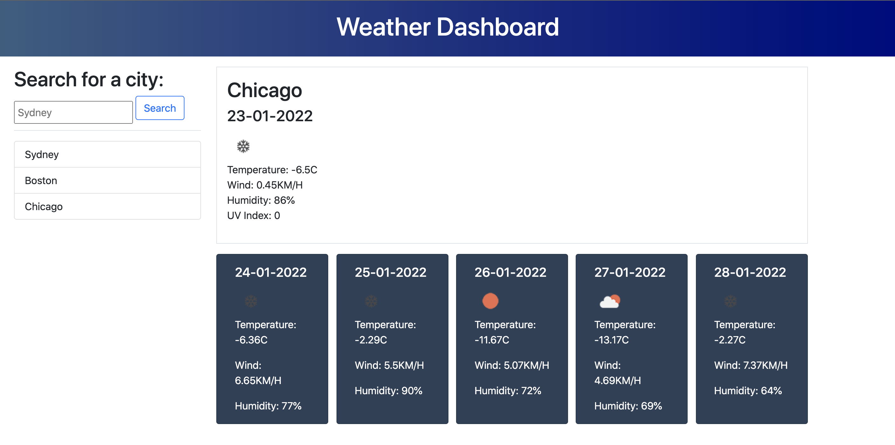

# Weather Dashboard

## Description
This project contains a dashboard that displays the current weather and the weather forecast for the next 5 days. The user can enter any city, or selected from previously entered cities, to display the relevant weather data.

## Built with
* HTML
* CSS
* JavaScript
* Moment.js
* Bootstrap

## 3rd Party API's
* [OpenWeatherAPI](https://openweathermap.org/api)

## Features
* Current date at the top of the page
* Current weather information
* 5 cards with tomorrow's date up to 5 days from now
* Weather forecast for 5 days
* List of previously searched for cities
* Input field to allow new cities to be searched for

## Getting started
### Installation
The responsitory is available for cloning [in Github](https://github.com/RachelHarris90/calendar-app).

### Usage
The website can be viewed [in Github pages](https://rachelharris90.github.io/weather-dashboard/).

## Credits
The author of this repository is Rachel Harris, a student of University of Sydney Fullstack Developer Bootcamp. 

## License
None.

## Tests
This code is not currently covered with automated tests.
